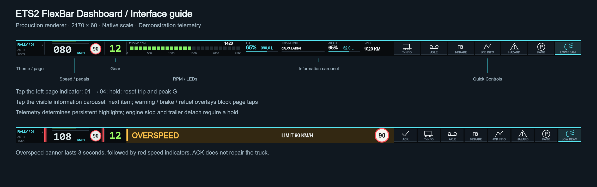

English | [简体中文](README.zh-CN.md)

# ETS2 FlexBar Dashboard


A DirectDraw dashboard for Euro Truck Simulator 2 and FlexBar on Windows x64. It displays SCS Telemetry SDK data and controls game bindings through an SCS Input SDK generic input device. **Version 1.0.1 — Touch and language hotfix (2026-10-02).** Restores DirectDraw touch controls and applies saved dashboard language immediately; the calibrated dashboard layout and game bridge are unchanged.

First use: install the `.flexplugin` and game bridge DLL, add the plugin to a FlexBar page, then tap its launcher once. This tap is a current DirectDraw host limitation. The launcher means “enter dashboard”, not “offline”. Follow the [Quick Start](docs/QUICKSTART.md) · [Issues](https://github.com/ASJS-CAT/ETS2-FlexBar-Dashboard/issues).

**Upgrading from 1.0.0:** install 1.0.1, then unplug/reconnect FlexBar once and re-enter the dashboard if touch remains unresponsive. The launcher uses the built-in bilingual cover; active dashboards use only DirectDraw. Settings and dashboard language remain separately configurable.

## Hardware Demo

Real-world setup running ETS2 FlexBar Dashboard on a physical FlexBar.


The dashboard shown above is running on real FlexBar hardware with Euro Truck Simulator 2.

## Features

- Speed, gear, RPM LEDs, speed limit, cruise and overlaid pedal tracks; fuel/AdBlue litres and percentages, trip average consumption, route and systems carousels.
- Telemetry-backed Static / Dynamic / Hybrid Quick Controls; warning ACK, three-second overspeed banner, braking, refueling and payment overlays.
- JOB INFO, T-INFO, attitude/XYZ and live/peak G; English and simplified Chinese; RALLY / MINT / AMBER themes.

## Requirements

Windows 10/11 x64; a 2170×60 FlexBar; FlexDesigner ≥ 2.0.6 (manifest minimum, not a claim that every combination is tested); ETS2 for Windows x64 and a driving save. The bridge uses the vendored SCS SDK 1.14 headers. Record the exact ETS2/firmware combination in hardware acceptance; untested versions are not guaranteed. End users installing the package do not need Node.js or a compiler.

## Quick Start and installation

1. Install the plugin and bridge DLL using the beginner guide. [Quick Start](docs/QUICKSTART.md)
2. Place the DLL at `bin/win_x64/plugins/ets2-flexbar.dll` inside your actual ETS2 installation, then launch the game and load a save.
3. Tap the FlexBar launcher to open Dashboard. Telemetry uses local 127.0.0.1 UDP ports 29762/29763; no web API or cloud account is required.

## ETS2 Input Binding

Enable Binding Mode in plugin settings. Select the Flexbar Rally device in ETS2 controls, select each game action and press the corresponding FlexBar button. NEXT SET cycles through three input sets. Disable Binding Mode afterward. The 14 boolean inputs are device buttons; their meaning comes from game bindings. No keyboard simulation, SendInput or window messages are used.

[Complete bindings and feedback table](docs/CONTROLS.md)

## Interface and pages



Tap the left theme/page indicator to cycle 01 Auto, 02 Controls, 03 Information and 04 Motion. Hold about 900 ms to reset the trip and peak G. Theme and page are independent. Tap the visible default, JOB INFO or T-INFO carousel to advance one item and restart its timer. Warning, braking and refueling overlays do not trigger carousel navigation.

## Themes

| ID | Label |
| --- | --- |
| rally | RALLY |
| el_mint | MINT |
| el_amber | AMBER |

Changing theme retains the page number. Seven-segment and font-based digits are selectable. System fonts and fallbacks are used; no commercial font files are distributed.

## Settings

Settings language and Dashboard language are saved independently; Dashboard can follow Settings. Configure FPS, units, themes, digit style, RPM range/labels, carousel selection/timing, manual-page duration, warning thresholds/rotation, braking/refueling/payment duration and Quick Controls mode/pins/order/hidden items. FlexDesigner persists saved settings across restarts. Production defaults are generated in [ui-structure.json](docs/ui-structure.json).

## Known Limitations

- DirectDraw requires a launcher tap on first entry; wakeOnStart does not guarantee bypassing the host entry. Dynamic Key is not part of this runtime.
- No fabricated ABS intervention, turbo/manifold pressure or blind-spot data. Camera/mirror and other controls without telemetry feedback show only click feedback, not persistent synthetic states.
- The braking-effect overlay uses measured longitudinal deceleration, including slope effects; it is not retarder torque. G is the SDK acceleration-vector magnitude without gravity compensation. TRIP AVERAGE needs 0.3 km of valid samples and is not instantaneous fuel consumption.
- Bindings depend on game configuration/language. Trailer-only controls disappear without a trailer. Engine stop and trailer detach require about 800 ms holds; detaching requires stopping.
- A telemetry interruption freezes the last view and releases inputs. Alt+Tab should preserve the trip. Font fallbacks may change glyph appearance. Third-party review records are available in [docs/legal-audit](docs/legal-audit/README.md).

## Troubleshooting

Still at launcher: tap it. OFFLINE: check the DLL location, SDK prompt and game log. Telemetry works but controls do not: check the Input SDK device and exit Binding Mode. Port conflict: avoid duplicate bridge/plugin instances. Missing Chinese glyphs: check Windows CJK fonts. A map/menu or background window is not automatically an explicit SDK PAUSED state.

Logs are under `%APPDATA%/FlexDesigner/data/plugins/com.local.ets2rally/logs/`. Review paths, device serials and game details before sharing. [Issues](https://github.com/ASJS-CAT/ETS2-FlexBar-Dashboard/issues).

## Development

Requires Node.js ≥22.20, npm, Windows x64 and Visual Studio Build Tools with Desktop development with C++.

```powershell
npm ci
npm run build
npm run native:test
npm test
npm run docs
npm run audit:release
# Only after all release blockers are resolved:
npm run plugin:validate
npm run plugin:pack
```

Packaging uses the official FlexCLI filename `com.local.ets2rally.flexplugin`. Keep the `com.local.ets2rally.plugin` directory. The tag must be exactly `1.0.1`, matching the manifest. CI builds artifacts without automatically publishing a public Release.

[CONTRIBUTING](CONTRIBUTING.md) · [RELEASE_CHECKLIST](RELEASE_CHECKLIST.md) · [RELEASE_AUDIT](RELEASE_AUDIT.md)

## License

Free for personal and non-commercial use. Modification and redistribution are permitted under the [PolyForm Noncommercial License 1.0.0](LICENSE). Commercial use, paid redistribution, resale, bundling for commercial purposes, or use in a commercial product/service requires separate permission from ASJS-CAT. The unmodified license text governs. Third-party components remain under their respective licenses; see [THIRD_PARTY_NOTICES.md](THIRD_PARTY_NOTICES.md). This is source-available software under a non-commercial source license, not an OSI-approved open-source license.

## Credits and disclaimer

Developed by ASJS-CAT with assistance from OpenAI Codex in implementation, debugging, regression testing and documentation. ASJS-CAT defined the requirements, calibrated the dashboard on real hardware and performed the final in-game acceptance testing.

Thanks to SCS Software for the Telemetry/Input SDK, ENIAC for the FlexDesigner SDK/FlexCLI, and the authors of Canvas and other dependencies. This is an unofficial community project, not affiliated with or endorsed by SCS Software or ENIAC. Product names identify compatibility only; project artwork does not use official trademark logos.
