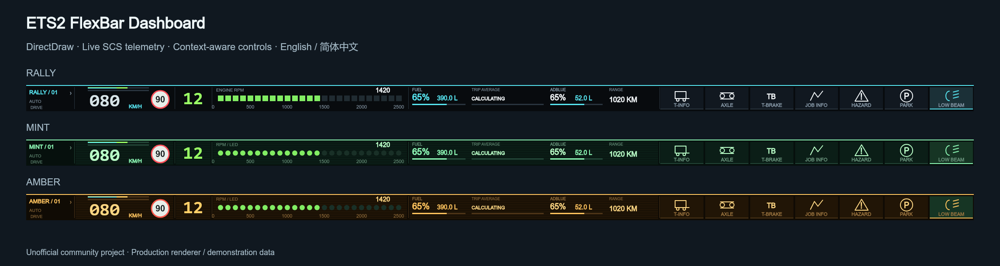
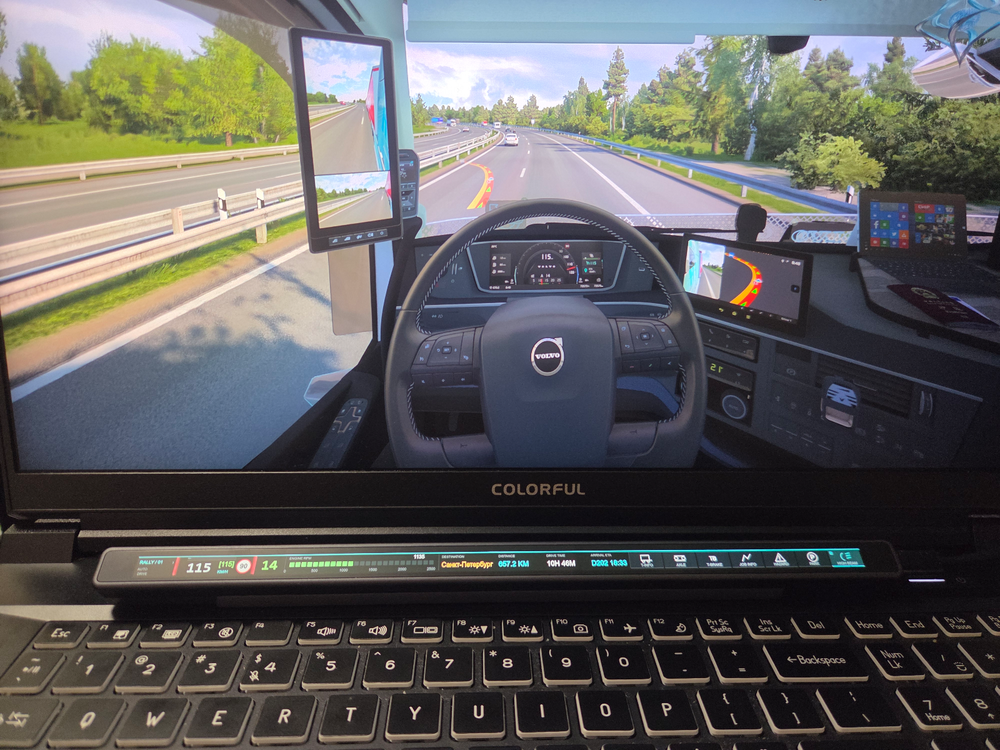
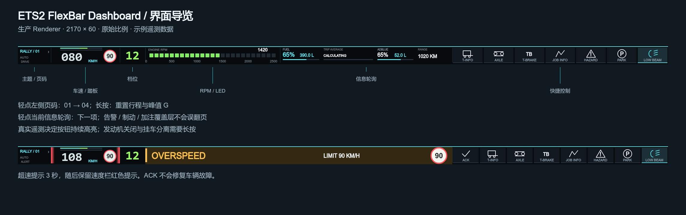

简体中文 | [English](README.md)

# ETS2 FlexBar Dashboard



面向 Windows x64 上 Euro Truck Simulator 2 与 FlexBar 的 DirectDraw 仪表盘。使用 SCS Telemetry SDK 显示车辆数据，用 SCS Input SDK 的 generic input 设备执行游戏内已绑定的操作。**Version 1.0.0 — First public release / 首个公开版本（2026-10-02）**。RC1 已通过真实 FlexBar + ETS2 实机验收，已验收 runtime 保持冻结。

首次使用：安装 `.flexplugin`、安装随附游戏桥接 DLL、将插件添加到 FlexBar 页面，然后轻点入口一次。这个点击是当前 DirectDraw 宿主限制；入口图表示“进入仪表盘”，不是离线状态。详见 [Quick Start](docs/QUICKSTART.zh-CN.md) · [Issues](https://github.com/ASJS-CAT/ETS2-FlexBar-Dashboard/issues).

## 实机展示

ETS2 FlexBar Dashboard 在真实 FlexBar 设备上的运行效果。



上图为插件在真实 FlexBar 硬件配合 Euro Truck Simulator 2 运行时的实际效果。

## 功能

- 车速、档位、RPM LED、限速、巡航与叠加踏板条；燃油/尿素升数和百分比、行程平均油耗、路线及系统数据轮询。
- 真实状态驱动的 Static / Dynamic / Hybrid Quick Controls；告警 ACK、三秒超速提示、制动、加注与支出覆盖层。
- JOB INFO、T-INFO、姿态/XYZ 与实时及峰值 G；中英双语，RALLY / MINT / AMBER 主题。

## 运行要求

Windows 10/11 x64；FlexBar 2170×60；FlexDesigner ≥ 2.0.6（manifest 最低版本，不代表所有组合已经验收）；Windows x64 ETS2、有效驾驶存档。桥接源码使用随仓库提供的 SCS SDK 1.14 头文件。ETS2 及固件具体组合仍需填写实机验收表，不宣称支持未测试版本。用户安装现成插件不需要 Node.js 或编译器。

## 快速开始与安装

1. 按双语新手指南安装插件与 DLL。 [Quick Start](docs/QUICKSTART.zh-CN.md)
2. DLL 放在你实际 ETS2 安装目录的 `bin/win_x64/plugins/ets2-flexbar.dll`，然后启动游戏并加载存档。
3. 轻点 FlexBar 的入口进入 Dashboard。遥测使用本机 127.0.0.1 UDP 29762/29763，不需要网页 API 或云端账号。

## ETS2 输入绑定

插件设置启用绑定模式，在 ETS2 控制设置里选择 Flexbar Rally 设备，逐项选中游戏功能再点击对应 FlexBar 按钮；NEXT SET 切换三组输入，完成后关闭绑定模式。14 个布尔输入只代表设备按钮，绑定含义由游戏设置决定。没有模拟键盘、SendInput 或窗口消息。

[完整绑定及反馈表](docs/CONTROLS.zh-CN.md)

## 界面与页面



左侧主题/页码点击循环：01 自动、02 控制、03 信息、04 姿态。长按约 900ms 重置本次行程及峰值 G。主题名与页码独立。默认中央信息窗、JOB INFO、T-INFO 可以点击切到下一项，并重置该项轮询计时；告警、制动、加注覆盖层不会触发信息切页。

## 主题

| ID | 短标签 |
| --- | --- |
| rally | RALLY |
| el_mint | MINT |
| el_amber | AMBER |

切换主题保留当前页码。数码管及字体风格可选；字体使用系统字体与 fallback，不附带商业字体文件。

## 设置

Settings 的界面语言与 Dashboard 语言分别保存，Dashboard 可跟随设置语言。还可配置 FPS、单位、主题、数字风格、RPM 量程/标签、轮询内容与时长、手动页停留、告警阈值和轮换、制动/加注/支出停留、Quick Controls 模式/固定项/顺序/隐藏项。保存后由 FlexDesigner 持久化，下次启动继续使用。完整默认值由生产代码生成于 [ui-structure.json](docs/ui-structure.json).

## 已知限制

- DirectDraw 第一次进入需要轻点入口；wakeOnStart 不保证绕过宿主入口。Dynamic Key 不在本版 runtime 中。
- 未取得可靠遥测的 ABS 介入、涡轮/歧管压力、左右盲区不提供伪数据。camera/mirror 等只有点击反馈，不伪造持续开关状态。
- 制动效果条使用车辆实际纵向减速度（受坡度等影响），不是缓速器力矩。G 使用 SDK 加速度向量模长，未补偿重力。TRIP AVERAGE 至少累计 0.3km 后计算，不是瞬时油耗。
- 输入绑定可能随游戏配置/语言不同；无挂车时相关按钮隐藏。发动机关闭与挂车分离需约 800ms 长按，挂车分离仅停车允许。
- 短暂失去遥测会冻结最后画面并释放输入；Alt+Tab 不应清空行程。字体 fallback 可能影响字形。第三方审计记录见 [docs/legal-audit](docs/legal-audit/README.md)。

## 排障

入口还在：先点击入口。OFFLINE：核对 DLL 路径、游戏 SDK 提示与游戏日志。有数据无操作：检查 Input SDK 设备与绑定模式是否已退出。端口占用：不要同时运行两份桥接/插件。缺字：检查 Windows 中文字体。不要把地图/菜单或后台窗口等同于明确的 SDK PAUSED。

日志在 `%APPDATA%/FlexDesigner/data/plugins/com.local.ets2rally/logs/`。上传前检查路径、设备序列号及游戏信息。 [Issues](https://github.com/ASJS-CAT/ETS2-FlexBar-Dashboard/issues).

## 开发

需要 Node.js ≥22.20、npm、Windows x64、Visual Studio Build Tools 的 C++ 桌面开发组件。

```powershell
npm ci
npm run build
npm run native:test
npm test
npm run docs
npm run audit:release
# Only after all release blockers are resolved:
npm run plugin:validate
npm run plugin:pack
```

打包使用官方 FlexCLI 文件名 `com.local.ets2rally.flexplugin`。插件目录保持 `com.local.ets2rally.plugin`。tag 必须精确为 `1.0.0`，与 manifest 一致。CI 只构建，不自动上传公开 Release。

[CONTRIBUTING](CONTRIBUTING.md) · [RELEASE_CHECKLIST](RELEASE_CHECKLIST.md) · [RELEASE_AUDIT](RELEASE_AUDIT.md)

## 许可

个人及非商业用途可免费使用，允许在 [PolyForm Noncommercial License 1.0.0](LICENSE) 条件下修改与再分发。商业使用、付费分发、转售、商业捆绑或用于商业产品/服务需要另行取得 ASJS-CAT 许可。以未改写的许可证原文为准。第三方组件继续适用各自许可证，见 [第三方声明](THIRD_PARTY_NOTICES.md)。本项目是非商业许可的源码可用项目，不宣称为 OSI 认可的开源项目。

## 致谢与免责声明

感谢 SCS Software 的 Telemetry/Input SDK、ENIAC 的 FlexDesigner SDK/FlexCLI、Canvas 及其他第三方组件作者。本项目为非官方社区项目，与 SCS Software 或 ENIAC 无隶属关系，亦未获其背书。产品名称仅用于识别兼容对象，项目配图不使用官方商标 Logo。
