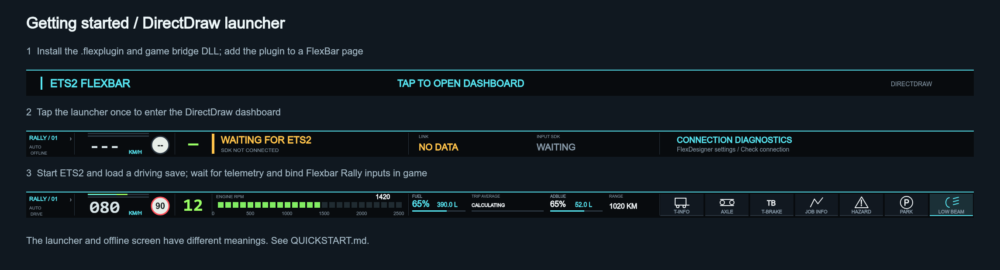

English | [简体中文](QUICKSTART.zh-CN.md)

# Beginner Quick Start

## 1. Prepare FlexDesigner

Install/update FlexDesigner from the device vendor and connect FlexBar. The manifest minimum is 2.0.6.

**EXPECTED RESULT：** FlexDesigner detects your FlexBar.

## 2. Install the RC plugin

Download the .flexplugin and ets2-flexbar.dll from the same approved RC. Compare their SHA-256 values against SHA256SUMS.txt (PowerShell: Get-FileHash -Algorithm SHA256 <file>). Import the .flexplugin through FlexDesigner’s plugin installation/import control.

**EXPECTED RESULT：** ETS2 Rally Dashboard appears in the plugin library.

## 3. Add the launcher

Drag the Dashboard item onto a FlexBar page, give it the full bar width, and apply/upload that page using FlexDesigner.

**EXPECTED RESULT：** The bar shows ETS2 FLEXBAR / TAP TO OPEN DASHBOARD.

## 4. Install the game bridge before launching ETS2

Close ETS2. In Steam, open ETS2 → Manage → Browse local files. In that actual game root, create bin/win_x64/plugins if absent. Back up an existing ets2-flexbar.dll and copy the RC DLL there. Do not put it in Documents/mod or the FlexDesigner plugin folder. No extra SDK headers need to be installed by users.

**EXPECTED RESULT：** The exact relative path is bin/win_x64/plugins/ets2-flexbar.dll.

## 5. Start ETS2 and confirm SDK loading

Start the Windows x64 game. If ETS2 displays its SDK/plugin confirmation, accept it to load the installed bridge. Inspect the game’s game.log.txt if the plugin cannot load.

**EXPECTED RESULT：** The bridge logs [Flexbar] Telemetry ready and the Input SDK device becomes available.

## 6. Enter DirectDraw

Tap the launcher on FlexBar once. Launcher is an entry action, not an OFFLINE screen.

**EXPECTED RESULT：** Dashboard opens. It may show waiting/offline before telemetry becomes available.

## 7. Load a save and enter the truck

Load your normal driving profile/save.

**EXPECTED RESULT：** CONNECTED telemetry produces the driving dashboard. An explicit game pause produces PAUSED; not every menu sends a pause event.

## 8. Choose language and theme

Open plugin Settings, choose Language and Dashboard language (English, Chinese, or follow), choose a theme and Save.

**EXPECTED RESULT：** Labels change and settings survive restart; theme changes retain the current page.

## 9. Bind the generic input device

Enable Binding Mode in plugin Settings. In ETS2 Options → Controls, select/add Flexbar Rally. In the relevant key/button binding screen, select a game action, then tap its FlexBar input. Use NEXT SET for the three sets. Consult CONTROLS.md; names may differ with ETS2 language.

**EXPECTED RESULT：** The binding field shows an input from Flexbar Rally; each desired function has its own binding.

## 10. Finish binding and test safely

Disable Binding Mode and Save. Keep the game in the foreground and the truck stationary. Test lights and hazard, then parking brake. Watch the actual game and telemetry feedback.

**EXPECTED RESULT：** Game actions occur; persistent highlights follow telemetry. Camera/mirror do not latch a fake ON state.

## 11. Try pages and lifecycle

Tap the left page indicator; tap the default/JOB/T-INFO carousel; test PAUSED, Alt+Tab and reconnect. Check RELEASE_CHECKLIST.md.

**EXPECTED RESULT：** Pages advance once per tap; the trip survives transient focus/transport changes.

## 12. If something fails

Check the DLL path, game.log.txt, FlexDesigner plugin logs, device bindings and UDP 29762/29763 conflicts. Disable duplicate copies. Share a redacted bug report with exact versions.

**EXPECTED RESULT：** A reproducible report identifies whether the failure is entry, telemetry or input binding.
