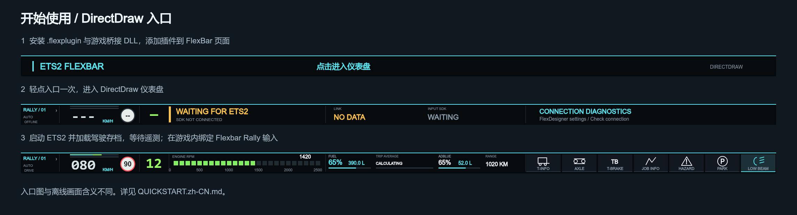

简体中文 | [English](QUICKSTART.md)

# 从零开始

## 1. 准备 FlexDesigner

从设备厂商渠道安装/更新 FlexDesigner 并连接 FlexBar；manifest 最低版本为 2.0.6。

**预期结果：** FlexDesigner 能识别 FlexBar。

## 2. 安装 RC 插件

取得同一已批准 RC 的 .flexplugin 与 ets2-flexbar.dll，用 PowerShell 的 Get-FileHash -Algorithm SHA256 <文件> 对照 SHA256SUMS.txt。通过 FlexDesigner 的插件安装/导入入口选择 .flexplugin。

**预期结果：** 插件库出现 ETS2 Rally Dashboard。

## 3. 添加入口

将 Dashboard 项拖到 FlexBar 页面，设为整条宽度，用 FlexDesigner 应用/上传页面。

**预期结果：** FlexBar 出现 ETS2 FLEXBAR / 点击进入仪表盘或英文入口。

## 4. 启动游戏前安装桥接 DLL

关闭 ETS2。在 Steam 中打开 ETS2 → 管理 → 浏览本地文件。在实际游戏根目录下创建 bin/win_x64/plugins（如不存在）。备份已有 ets2-flexbar.dll，再复制 RC 的 DLL。不要放到 Documents/mod 或 FlexDesigner 插件目录，用户不需要安装 SDK 头文件。

**预期结果：** 相对路径准确为 bin/win_x64/plugins/ets2-flexbar.dll。

## 5. 启动 ETS2 并确认 SDK

启动 Windows x64 游戏。若弹出 SDK/插件确认，允许加载已安装桥接。不能加载时检查游戏的 game.log.txt。

**预期结果：** 日志出现 [Flexbar] Telemetry ready，Input SDK 设备可用。

## 6. 进入 DirectDraw

在 FlexBar 轻点入口一次。入口表示进入操作，不表示 OFFLINE。

**预期结果：** 仪表盘打开；遥测就绪前可能显示等待/离线。

## 7. 加载驾驶存档

加载你正常使用的存档并进入卡车。

**预期结果：** 收到 CONNECTED 遥测后出现驾驶仪表。明确 SDK 暂停才显示 PAUSED，不是所有菜单都会触发暂停。

## 8. 设置语言与主题

打开插件 Settings，选择设置语言和仪表盘语言（英文、中文或跟随），选择主题并保存。

**预期结果：** 文字切换并跨启动保存；切换主题保留当前页码。

## 9. 绑定 generic input 设备

在插件设置启用绑定模式。在 ETS2 选项 → 控制中选择/添加 Flexbar Rally。在对应的按键/按钮绑定界面选择游戏功能，再点击 FlexBar 对应输入。NEXT SET 切换三组，详见 CONTROLS.zh-CN.md；游戏语言不同会影响功能名。

**预期结果：** 绑定栏显示 Flexbar Rally 的输入，每个所需功能都有对应绑定。

## 10. 退出绑定并测试

关闭绑定模式并保存。保持游戏在前台，车辆静止；先测试灯光、双闪，再测试驻车制动，观察实际游戏与遥测反馈。

**预期结果：** 游戏动作生效；持续高亮跟随遥测，camera/mirror 不会锁定伪 ON 状态。

## 11. 测试页面与生命周期

轻点左侧页码，轻点默认/JOB/T-INFO 轮询栏，测试暂停、Alt+Tab 与重连，按 RELEASE_CHECKLIST.md 验收。

**预期结果：** 每次点击前进一项；短暂焦点或连接变化不清空行程。

## 12. 故障定位

检查 DLL 路径、game.log.txt、FlexDesigner 插件日志、设备绑定和 UDP 29762/29763 冲突，禁用重复副本，提供脱敏的版本及复现信息。

**预期结果：** 明确故障属于入口、遥测还是输入绑定。
